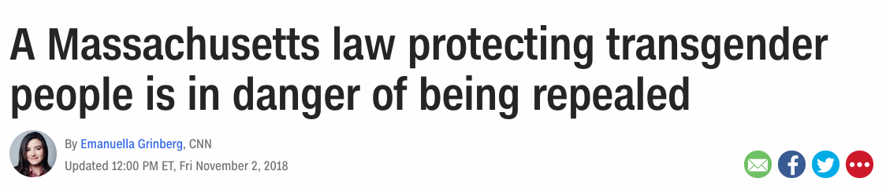
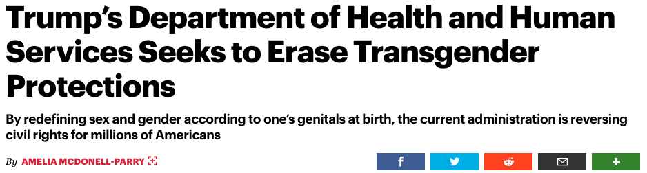
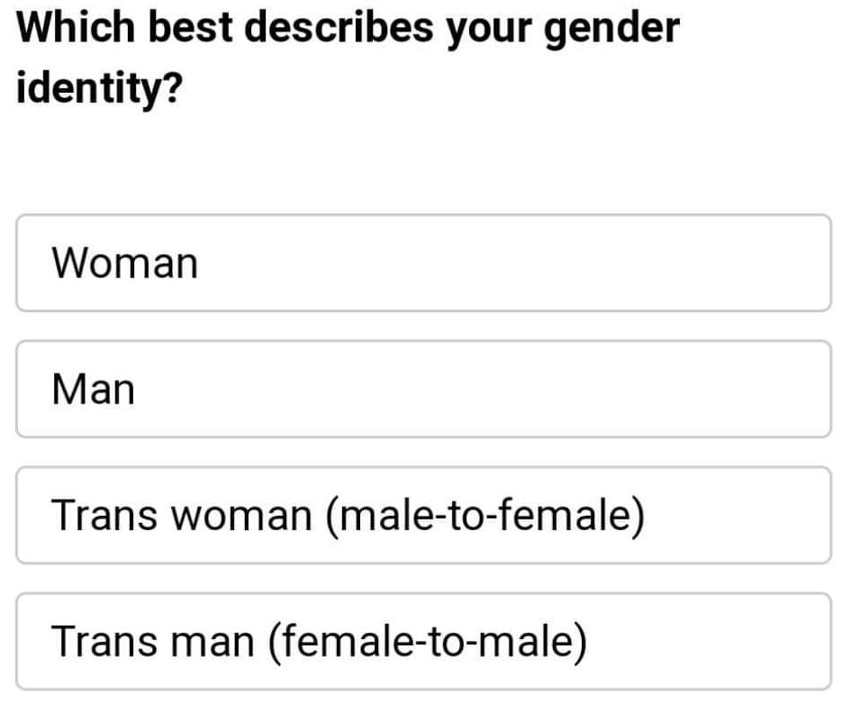
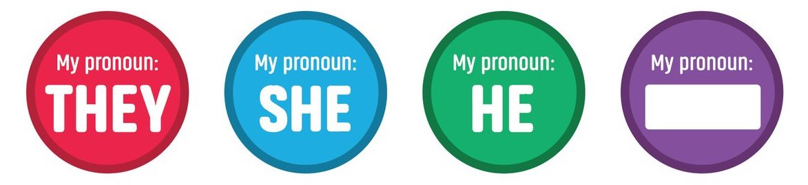

<!-- .slide: data-background="#3F51B5" class="dark" -->

### Trans rights

###### Cal Gunnarsson, MIT BE

###### GSC DIS 

###### May 9, 2019

---

### Why this presentation?

- Self-interest :heart\_eyes\_cat:
- Lessons learned from trans advocacy  
- Lessons for advocacy in general??? 

---

### Acknowledgements

- Miguel Alcantar (MIT BE)
- Title IX Student Advisory Committee
- BE graduate students (and Board)

---

<section style="text-align: left;">

### 1. Trans issues
### 2. Trans advocacy
### 3. What we're doing 
### 4. Lessons learned

---

<!-- .slide: data-background="#3F51B5" class="white" -->

## 1. Trans issues

---

### Transgender = gender differs from sex assigned at birth

Trans women, trans men, nonbinary people...

---

### Trans people are diverse

- Experiences of binary and nonbinary people
- Experiences of trans women and trans men
- Intersectional experiences
- Different priorities for transitions and "passing"

---

<section style="text-align: left;">

### Trans people face legal discrimination 

###### Proposition 3

###### Title IX

---

<section style="text-align: left;">

### Trans people face structural discrimination
* ID cards and name changes

* Gender markers

* Security lines

* :toilet:

---

<section style="text-align: left;">

### Trans people face social discrimination

* Violence and harassment

* Deadnaming 

* Misgendering

---

<section style="text-align: left;">

### Trans graduate students [report a chilly climate](https://wordpress.clarku.edu/agoldberg/files/2018/07/Goldberg-Kuvalanka-dickey-2018-JDHE-1.pdf)

**67%** say safety influences gender presentation

**33%** misgendered "often" by students

**32%** misgendered "often" by faculty

---

Examples are _frequent, pervasive, and obvious_

---

<!-- .slide: data-background="#3F51B5" class="dark" -->

## 2. Trans advocacy

---

### Lots to be done but...

- Lack of specific education 
- Problems are institutional, not always departmental

---

### Trans inclusivity = beliefs + repeated, visible action

- Trans exclusion is the *norm*
- Are trans women explicitly included in my programming for women?
- Does my LGBTQ event have gender neutral bathrooms?

---

### Surveys can be hard...

- hard to get "quantitative support"
- hard to anonymize 

---

### ... and marginalizing 

---

<!-- .slide: data-background="#3F51B5" class="dark" -->

## 3. What we're doing

---

### A more inclusive interview weekend

- Asking about accommodations beforehand
- Pronoun stickers at graduate student events
- Diversity panel at interview weekend

---

### Pronoun stickers at graduate student events
- Worked with Title IX office to roll out stickers
- Current students briefed on pronoun etiquette
- Discussed at faculty meeting
- Put together [pronoun explainer](https://titleix.mit.edu/pronouns) to accompany stickers

---

### Diversity panel 

- Women, URM, LGBTQ+ people, people with disabilities
- Prepared and sent questions to panelists
- Audience questions in person and anonymous

---

### Future work

- Gender neutral bathrooms, prayer rooms, lactation rooms
- Event planning accessibility checklists

---

<!-- .slide: data-background="#3F51B5" class="dark" -->

## 4. Lessons learned

---

### Find low-hanging fruit first

What _don't_ we need "permission" for?

---

### Changing people's behaviors changes their beliefs -- not the other way around

- Make norms visible and easy to follow

- Inertia can be your friend!

---

### Graduate students can harness certain forms of power

- We host interview weekend
 
- We run lab websites

- We make syllabi

---

### It helps to stick together

- Pull other underrepresented groups along where we can

- Stick together across departments

- Stick together across undergraduate/graduate

---

## Thanks for listening!

